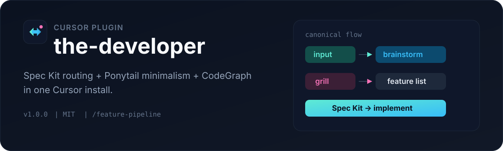
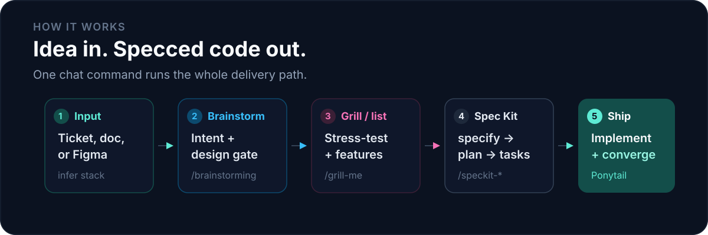

<p align="center">
  
</p>

# the-developer

Cursor **plugin** that routes AI-assisted work from idea → design → Spec Kit → code. Ships Ponytail (write less), CodeGraph (navigate structure), and companion skills in one install.

Full plugin reference: [PLUGIN.md](PLUGIN.md)

<p align="center">
  
</p>

## What you get

| Layer | Role |
|-------|------|
| **Feature flow** | `input → brainstorming → grill-me / document / feature list → Spec Kit → implement` |
| **Spec Kit** | Per-project specify → plan → tasks → implement → converge |
| **Ponytail** | Minimal-code ladder (`rules/ponytail.mdc` + skills) |
| **CodeGraph** | MCP `codegraph_explore` + sync hooks |
| **Companion** | Review, debug, commit, grill, hallmark UI, React/Nest patterns, agent-browser |
| **MCPs** | CodeGraph, Postgres / MySQL / MongoDB, Next.js `next-devtools`, Inspo |

<details>
<summary>Optional extras (Figma, HyperFrames, DB env)</summary>

- **Figma → code** — `/figma-design-to-code` when Figma MCP is enabled (not bundled in `mcp.json`)
- **Inspo** — real-site design refs via [inspomcp.dev](https://inspomcp.dev/)
- **DB MCPs** — env vars in [`docs/mcp-databases.env.example`](docs/mcp-databases.env.example)
- **HyperFrames demo** — `/hyperframes-demo` only when you ask for a video demo

</details>

<p align="center">
  
</p>

## Quick install (local)

```powershell
.\scripts\install-plugin-local.ps1
```

Then **Developer: Reload Window** → open **Customize** → confirm `the-developer`.

Marketplace / team publish: [cursor.com/marketplace/publish](https://cursor.com/marketplace/publish)

## Host CLIs (once per machine)

```bash
npm i -g @colbymchenry/codegraph agent-browser
agent-browser install
uv tool install specify-cli --from git+https://github.com/github/spec-kit.git
```

In each app repo:

```bash
specify init --here --integration cursor-agent
codegraph init
```

## Start here

| Command | When |
|---------|------|
| `/feature-pipeline` | New feature — full path end to end |
| `/brainstorming` | Intent & design (stage 1 after input) |
| `/grill-me` | Stress-test design before Spec Kit |
| `/hallmark` | Any new UI or frontend visual update |
| `/code-review` | Correctness / security review |
| `/browser-test` | agent-browser QA |

<details>
<summary>More commands</summary>

| Command | Does |
|---------|------|
| `/codebase-design` | Deep modules / seams |
| `/nodejs-backend-patterns` | Node.js API / backend patterns |
| `/nestjs-best-practices` | NestJS architecture / DI / security |
| `/nestjs-expert` | NestJS expert workflow + guide |
| `/diagnose-bug` | Hard-bug diagnosis loop |
| `/tdd` | Test-first red-green-refactor |
| `/prototype` | Throwaway probe before a change |
| `/to-spec` | Conversation → spec/PRD (issue tracker) |
| `/extract-meaning-full-insight` | Insight pack from a document |
| `/document-to-flowchart` | Document → Mermaid flowchart |
| `/figma-design-to-code` | Figma MCP design → code |
| `/ui-case-studies` | Settings & common-screen defaults |
| `/extract-modules-checklist` | Modules → checklist before big refactors |
| `/claude-delegate` | Delegate impl to Claude Code CLI |
| `/hyperframes-demo` | Optional video demo (user must ask) |

</details>

## Plugin layout

```text
.cursor-plugin/plugin.json   # Cursor Plugin manifest
rules/                       # always-on + glob rules
skills/                      # companion + ponytail + design/QA
agents/the-developer.md
commands/
hooks/hooks.json             # CodeGraph sync
scripts/codegraph-sync.js
mcp.json
assets/logo.svg
```

## Docs

- [PLUGIN.md](PLUGIN.md) — install, MCP, usage in a project
- [Cursor Plugins](https://cursor.com/docs/plugins)
- [Spec Kit](https://github.com/github/spec-kit)
- [Ponytail](https://github.com/DietrichGebert/ponytail)
- [CodeGraph](https://github.com/colbymchenry/codegraph)
- [agent-browser](https://www.skills.sh/vercel-labs/agent-browser/agent-browser)
- [hallmark](https://github.com/nutlope/hallmark)
